<h1 align="center">Hi, I'm MarcoDotIO 👋</h1>

  <strong>Swift &amp; Apple platforms · AI agents · Robotics &amp; HRI</strong>

  Lead Senior Engineer @ <a href="https://github.com/OpenDive">OpenDive</a> · PhD Researcher in Telerobotics &amp; HRI @ Kent State

  <a href="https://x.com/marcodotio">X / @marcodotio</a> ·
  <a href="https://www.linkedin.com/in/marcus-a-arnett/">LinkedIn</a> ·
  <a href="https://www.youtube.com/c/marcodotio">YouTube</a>

---

I build Swift SDKs, AI agent tooling, and robotics software. My work connects native Apple apps, language models, and human–robot interaction.

- **Native AI:** Swift packages, Foundation Models, streaming, structured output, and tool calling.
- **Robotics research:** telerobotics, shared autonomy, and how people communicate intent to robots.
- **Developer tools:** reproducible ROS 2 environments and MCP integrations for research workflows.

### Selected work

| Project | What I'm building |
| --- | --- |
| [**OpenClawKit**](https://github.com/MarcoDotIO/OpenClawKit) | Swift SDK for AI agents, gateways, channels, and MCP integrations. |
| [**OpenAIKit**](https://github.com/OpenDive/OpenAIKit) | Community-maintained Swift SDK for the OpenAI API. |
| [**GrokLanguageModel**](https://github.com/MarcoDotIO/GrokLanguageModel) | Grok through Apple's Foundation Models APIs, with streaming, structured output, and tools. |
| [**rosenv**](https://github.com/MarcoDotIO/rosenv) | ROS 2 project and dependency management with persistent Docker environments and lockfiles. |
| [**PepperKit**](https://github.com/ATR-Lab/PepperKit) | Pepper robot stack combining a QiSDK Android client with an OpenAI Realtime backend. |
| [**overleaf-latex**](https://github.com/MarcoDotIO/overleaf-latex) | MCP tools to create, edit, and compile LaTeX projects in Overleaf. |
| [**SuiKit**](https://github.com/OpenDive/SuiKit) | Swift SDK for Sui: transaction building, signing, and object management. |
| [**Sui-Unity-SDK**](https://github.com/OpenDive/Sui-Unity-SDK) | C# SDK for Sui-powered Unity games, with local transaction building and zkLogin. |

### Highlights

- **2025 · Sui Overflow:** 1st place, Explorations.
- **2024 · ETH Denver:** Best Solana Social Application.
- **2023 · ETH New York:** 1st place, WalletConnect “Best for Mobile.”
- Published research in **human–robot interaction**, **child–robot interaction**, and **environmental education**.

### Languages & tools

  
  
  
  
  
  
  
  
  
  
  

Swift / SwiftUI · Python · TypeScript / JavaScript · Rust · C# / Unity · Kotlin · ROS 2 · Docker · Git

### GitHub activity

<!-- Cards are generated daily and committed by .github/workflows/update-readme-stats.yml. -->

  
  

  

  Language statistics reflect repository code size, not proficiency. <a href="https://github.com/MarcoDotIO/MarcoDotIO/actions/workflows/update-readme-stats.yml">Card refresh status</a>

